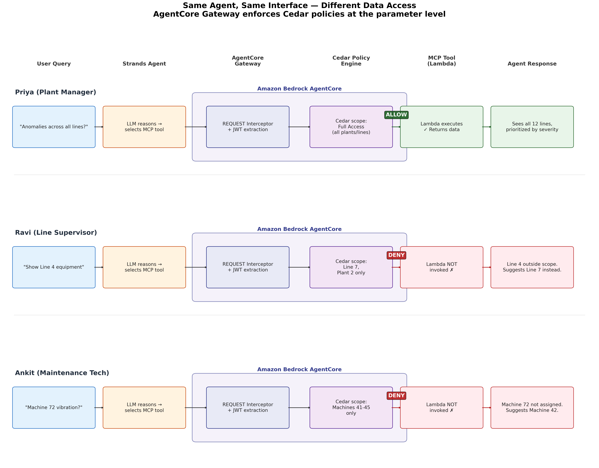

# Generate Autonomous Business Insights with AI Agent and MCP Servers

This repository contains the sample code for the AWS blog post: [Generate Autonomous Business Insights with AI Agent and MCP Servers](https://aws.amazon.com/blogs/machine-learning/generate-autonomous-business-insights-with-ai-agent-and-mcp-servers/).

## Overview

> **Important:** This sample code is provided for **demonstration and educational purposes only**. It is not intended for production use without further review, testing, and hardening. Use this code as a reference implementation to understand the architecture patterns. Before deploying to production, conduct your own security review, implement proper error handling, and follow your organization's deployment practices.

This sample implements a **working multi-agent system** that transforms natural language questions into cross-system manufacturing insights. It uses [Amazon Bedrock AgentCore](https://aws.amazon.com/bedrock/agentcore/), [Strands Agents SDK](https://strandsagents.com/), and the [Model Context Protocol (MCP)](https://modelcontextprotocol.io/) to demonstrate how enterprises can close the gap between data and decisions through configuration, not custom platform engineering.

**The problem**: A plant manager needs to know which assembly lines need attention this week. The answer requires correlating data from IoT sensors, equipment maintenance logs, supply chain inventory, and production analytics — five disconnected systems that today require hours of manual stitching.

**This solution**: A single Strands Agent connects to four domain MCP servers. The LLM's reasoning loop autonomously decides which tools to call — no custom orchestrator needed. Users ask questions in natural language; the agent handles routing, access control, and synthesis.

## Architecture

```
┌─────────────────────────────────────────────────────────────────────────────┐
│                  Autonomous BI Architecture — Amazon Bedrock AgentCore       │
│                         Users — natural language queries                     │
│  ┌──────────────────┐  ┌──────────────────┐  ┌──────────────────┐          │
│  │ Sarah—plant mgr  │  │ Raj—line supv    │  │ Priya—maint tech │          │
│  └────────┬─────────┘  └────────┬─────────┘  └────────┬─────────┘          │
└───────────┼──────────────────────┼──────────────────────┼───────────────────┘
            │                      │                      │
┌───────────▼──────────────────────▼──────────────────────▼───────────────────┐
│  Amazon Bedrock                                                             │
│  Natural language understanding · Intent classification · Response synthesis│
└─────────────────────────────────┬───────────────────────────────────────────┘
                                  │
┌─────────────────────────────────▼───────────────────────────────────────────┐
│  Amazon Bedrock AgentCore                                                   │
│  ┌───────────────────────────────────────────────────────────────────┐      │
│  │                         Agent                                     │      │
│  │   (single Strands Agent — LLM reasoning selects tools to call)    │      │
│  └───────────────────────────────┬───────────────────────────────────┘      │
│                                  │                                          │
│  ┌───────────────────────────────▼───────────────────────────────────┐      │
│  │                         Gateway                                   │      │
│  │        MCP router · 3-tier cache · Policy enforcement             │      │
│  └──────┬──────────────┬──────────────┬──────────────┬───────────────┘      │
│         │              │              │              │                       │
│  ┌─────────────┐ ┌──────────────┐ ┌───────────────┐ ┌─────────────┐       │
│  │  Runtime    │ │   Identity   │ │    Memory     │ │  Registry   │       │
│  │ Firecracker │ │ Okta, IAM,   │ │  Short-term + │ │  Discover,  │       │
│  │  microVMs   │ │  Cognito     │ │  Long-term    │ │   govern    │       │
│  └─────────────┘ └──────────────┘ └───────────────┘ └─────────────┘       │
│  ┌──────────────┐                                                           │
│  │    Policy    │                                                           │
│  │ Cedar, Authz │                                                           │
│  └──────────────┘                                                           │
└─────────┼──────────────┼──────────────┼──────────────┼──────────────────────┘
          │              │              │              │
          ▼              ▼              ▼              ▼  (Gateway → MCP servers)
┌─────────────────────────────────────────────────────────────────────────────┐
│  Semantic Layer — SageMaker Data Catalog                                    │
│  ┌──────────┐ ┌──────────┐ ┌──────────┐ ┌──────────┐ ┌──────────┐         │
│  │  Table   │ │  Column  │ │ Business │ │   Data   │ │  Source  │         │
│  │  Schemas │ │  Descrip.│ │ Glossary │ │  Lineage │ │ Mappings │         │
│  └──────────┘ └──────────┘ └──────────┘ └──────────┘ └──────────┘         │
└─────────────────────────────────┬───────────────────────────────────────────┘
                                  │
┌─────────────────────────────────▼───────────────────────────────────────────┐
│  Pre-built MCP server connectors — configuration, not code                  │
│  ┌──────────┐ ┌──────────┐ ┌──────────┐ ┌──────────┐ ┌──────────┐         │
│  │Equipment │ │   IoT    │ │  Supply  │ │Analytics │ │+ Custom  │         │
│  │MCP server│ │Telemetry │ │  Chain   │ │MCP server│ │ Low-code │         │
│  │          │ │MCP server│ │MCP server│ │          │ │          │         │
│  └──────────┘ └──────────┘ └──────────┘ └──────────┘ └──────────┘         │
└─────────────────────────────────┬───────────────────────────────────────────┘
                                  │
┌─────────────────────────────────▼───────────────────────────────────────────┐
│  Data Infrastructure                                                        │
│  ┌──────────┐ ┌──────────┐ ┌──────────┐ ┌──────────┐ ┌──────────┐         │
│  │SageMaker │ │  Amazon  │ │ Amazon   │ │  Amazon  │ │  Amazon  │         │
│  │Lakehouse │ │ Redshift │ │S3 Tables │ │OpenSearch│ │  Aurora  │         │
│  └──────────┘ └──────────┘ └──────────┘ └──────────┘ └──────────┘         │
└─────────────────────────────────────────────────────────────────────────────┘
```

### Sequence Diagrams

**Access Control Flow** — How the Gateway enforces Cedar policies before tool invocation:


**User Personas** — Same question, different access scopes:



## What This Sample Implements

| Layer | Implementation | Production Equivalent |
|-------|---------------|----------------------|
| Agent | Single Strands `Agent` with tools from all MCP servers | Same, deployed on AgentCore Runtime |
| Semantic Layer | MCP server for data source discovery (glossary, lineage) | SageMaker Data Catalog |
| MCP Servers | 5 FastMCP servers (Semantic + 4 domain) via streamable HTTP | Pre-built AgentCore connectors |
| Gateway | AgentCore Gateway with Cedar policy enforcement (local simulation fallback for dev) | AgentCore Gateway with 3-tier cache |
| Identity | Role-based user models with scope attributes | Okta/Cognito via AgentCore Identity |
| Policy | Cedar-style allow/deny evaluation per tool call | AgentCore Policy (Cedar, formally verified) |
| Memory | In-memory session + cross-session store | AgentCore Memory (user/team/org namespaces) |
| Data — Equipment | Aurora PostgreSQL Serverless v2 (RDS Data API) | SAP S/4HANA via Zero-ETL → Aurora |
| Data — IoT | Amazon Timestream (time-series query API) | AWS IoT Core → MSK → Timestream |
| Data — Supply Chain | Amazon Redshift Serverless (Redshift Data API) | SAP MM → Zero-ETL → Redshift |
| Data — Analytics | Amazon Redshift Serverless (OEE aggregations) | Production ETL → Redshift |
| Data — Quality | Amazon OpenSearch Serverless (semantic search) | SAP QM → MSK → OpenSearch |
| Data — Config | Amazon S3 (JSON config, catalogs) | S3 Data Lake / S3 Tables |
| Ingestion | IoT Core rule → Timestream | Kepware → IoT Core → MSK → Lakehouse |

## Prerequisites

### All Modes (Required)

| Requirement | Details |
|-------------|---------|
| Python | 3.10 or later |
| AWS account | [Free tier eligible](https://aws.amazon.com/free/) |
| Amazon Bedrock access | [Enable model access](https://docs.aws.amazon.com/bedrock/latest/userguide/model-access.html) for **Anthropic Claude Sonnet** in your region |
| AWS CLI | [v2.x](https://aws.amazon.com/cli/), configured with credentials (`aws configure`) |
| pip | 21.0 or later |

### Additional for Live Data Mode

| Requirement | Details |
|-------------|---------|
| CloudFormation deployment | `deploy/cloudformation/template.yaml` provisions Aurora, Timestream, Redshift, OpenSearch, S3 |
| IAM permissions | Permissions to create RDS clusters, Timestream databases, Redshift workgroups, OpenSearch collections, S3 buckets, Cognito user pools |

### Additional for Pre-built MCP Mode

| Requirement | Details |
|-------------|---------|
| uv | [Install uv](https://docs.astral.sh/uv/getting-started/installation/) — the `uvx` command runs pre-built MCP servers |
| Docker (alternative) | 20.10+ if running pre-built servers via Docker instead of uvx |

### Supported Regions

This sample works in any AWS region where Amazon Bedrock Claude Sonnet is available. The default region is `us-east-1`. For live data mode, all services (Aurora, Timestream, Redshift, OpenSearch Serverless) must be deployed in the same region.

### Credential Verification

Before starting, confirm your AWS credentials are configured:

```bash
# Verify CLI access
aws sts get-caller-identity

# Verify Bedrock model access (should list Claude Sonnet)
aws bedrock list-foundation-models --query "modelSummaries[?contains(modelId, 'claude')].[modelId]" --output table
```

## Deployment

> **Important:** The `.env` file used in this sample is suitable for **local development only**. For production deployments, use [AWS Secrets Manager](https://docs.aws.amazon.com/secretsmanager/latest/userguide/) to store sensitive credentials and reference them via IAM roles. Never commit `.env` files to version control.

### Option 1: Local Demo with Web UI (Recommended)

Runs entirely on your machine with simulated data. Only requires Bedrock model access. Includes a Streamlit chat interface.

**What you need:** Python 3.10+, AWS CLI configured, Bedrock Claude Sonnet access.

```bash
# 1. Clone the repository
git clone https://github.com/aws-samples/sample-autonomous-business-insights-with-ai-agent-and-mcp-servers.git
cd sample-autonomous-business-insights-with-ai-agent-and-mcp-servers

# 2. Create and activate virtual environment
python3 -m venv .venv
source .venv/bin/activate  # On Windows: .venv\Scripts\activate

# 3. Install dependencies
pip install -r requirements.txt

# 4. Configure environment
cp .env.example .env
# Edit .env:
#   - Set AWS_REGION if not us-east-1
#   - SIMULATION_MODE=true  (already set in .env.example)
#   - DATA_MODE=simulated   (already set in .env.example)

# 5. Start MCP servers (keep this terminal running)
python -m src.servers.start_all

# 6. In a new terminal, launch the web UI
source .venv/bin/activate
streamlit run src/demo_ui.py
```

Open **http://localhost:8501** in your browser. The UI provides:
- User persona selector (Sarah / Raj / Priya) with visible access scopes
- Chat interface with markdown-rendered responses
- Clickable sample queries per persona
- Live policy enforcement demonstration

### Option 1b: CLI Mode

For terminal-only usage without the web UI:

```bash
# With MCP servers running in another terminal:
python -m src.main
```

### Option 2: Live Data (Full AWS Infrastructure)

Deploy the complete data infrastructure — Aurora, Timestream, Redshift, OpenSearch, S3, IoT Core — and connect MCP servers to real AWS services.

**What you need:** Everything from Option 1, plus IAM permissions to create infrastructure resources.

```bash
# 1. Deploy all infrastructure (takes ~15 minutes)
aws cloudformation deploy \
  --template-file deploy/cloudformation/template.yaml \
  --stack-name manufacturing-insights-dev \
  --capabilities CAPABILITY_NAMED_IAM \
  --parameter-overrides Environment=dev DatabasePassword='<YOUR_SECURE_PASSWORD>'

# 2. Get stack outputs and configure .env
aws cloudformation describe-stacks \
  --stack-name manufacturing-insights-dev \
  --query "Stacks[0].Outputs" --output table

# 3. Copy outputs into your .env file:
#    AURORA_CLUSTER_ARN, AURORA_SECRET_ARN, TIMESTREAM_DATABASE,
#    REDSHIFT_WORKGROUP, OPENSEARCH_ENDPOINT, DATA_LAKE_BUCKET
#    Set:
#      SIMULATION_MODE=true   (still using local MCP servers)
#      DATA_MODE=live         (but now querying real AWS services)

# 4. Seed all data sources with sample manufacturing data
python deploy/seed_data.py

# 5. Start MCP servers and UI
python -m src.servers.start_all
streamlit run src/demo_ui.py
```

The CloudFormation stack provisions:
- **Aurora PostgreSQL Serverless v2** — equipment registry, maintenance history
- **Amazon Timestream** — IoT sensor time-series (vibration, temperature, pressure)
- **Amazon Redshift Serverless** — supply chain inventory, OEE analytics
- **Amazon OpenSearch Serverless** — quality metrics with semantic search
- **Amazon S3** — data lake (config, catalogs, raw data)
- **AWS IoT Core rule** — ingests MQTT sensor data into Timestream
- **Amazon Cognito** — user authentication with role attributes
- **IAM roles** — least-privilege execution permissions

### Option 3: Amazon Bedrock AgentCore (Production)

Deploy with full isolation, serverless scaling, and governance. This is the default architecture (`SIMULATION_MODE=false`) — the agent connects to the AgentCore Gateway, which handles policy enforcement, tool routing, and data retrieval via Lambda targets.

**What you need:** Everything from Option 2, plus an AgentCore-enabled AWS account.

```bash
python deploy/agentcore_deploy.py --region us-east-1
```

In this mode, local MCP servers and `data_provider.py` are bypassed entirely. The Gateway routes tool calls to Lambda functions that query AWS services directly.

## Usage

### Understanding Operating Modes

This sample has **two independent configuration axes** that together determine its behavior:

#### 1. SIMULATION_MODE — Where does the agent run?

| Value | Behavior | When to Use |
|-------|----------|-------------|
| `false` (default) | Agent connects to **AgentCore Gateway**. Policy enforcement, tool routing, and data retrieval happen server-side via Lambda targets. Local MCP servers are NOT used. | Production deployment with a deployed Gateway |
| `true` | Agent connects to **local MCP servers** with a local policy hook (`gateway_hook.py`). This is a development/demo simulation of what the Gateway does server-side. | Local development, demos, testing without a Gateway |

#### 2. DATA_MODE — Where does data come from? (SIMULATION_MODE=true only)

This setting is **only relevant when `SIMULATION_MODE=true`** (local MCP servers). When using the AgentCore Gateway, data retrieval is handled by Lambda targets regardless of this setting.

| Value | Behavior | AWS Services Required |
|-------|----------|----------------------|
| `simulated` (default) | In-memory sample data from `src/data/sample_data.py` | Only Amazon Bedrock |
| `live` | Real AWS service queries (Aurora, Timestream, Redshift, OpenSearch) | Full infrastructure stack |

#### Decision Matrix

```
┌─────────────────────────────────────────────────────────────────────┐
│ How should I configure this sample?                                  │
├─────────────────────────────────────────────────────────────────────┤
│                                                                      │
│  "I want to try it quickly"                                         │
│   → SIMULATION_MODE=true, DATA_MODE=simulated (the .env.example)    │
│   → Only need: Python + AWS credentials + Bedrock access            │
│                                                                      │
│  "I want real data but no Gateway"                                  │
│   → SIMULATION_MODE=true, DATA_MODE=live                            │
│   → Need: CloudFormation stack deployed + credentials in .env       │
│                                                                      │
│  "I want the full production architecture"                          │
│   → SIMULATION_MODE=false (DATA_MODE is ignored)                    │
│   → Need: Deployed AgentCore Gateway + Lambda targets               │
│                                                                      │
└─────────────────────────────────────────────────────────────────────┘
```

#### USE_PREBUILT_MCP — Pre-built vs Custom MCP Servers

When `SIMULATION_MODE=true`, you can additionally control which MCP server implementations to use:

| Mode | Environment Variables | What Happens |
|------|----------------------|-------------|
| **All Custom** (default) | `USE_PREBUILT_MCP=false` | All 5 MCP servers are custom FastMCP implementations running locally |
| **Pre-built + Custom** | `USE_PREBUILT_MCP=true` | Uses `awslabs.postgres-mcp-server` and `awslabs.redshift-mcp-server` (via uvx) for Aurora/Redshift. Custom servers only for Timestream, OpenSearch, and Semantic Layer |

The pre-built mode demonstrates the blog's "configuration, not code" principle — you don't build MCP servers for services that already have one.

| Data Source | Pre-built AWS MCP Server | Custom MCP Server | When to Use Each |
|-------------|-------------------------|-------------------|-----------------|
| Aurora PostgreSQL | `awslabs.postgres-mcp-server` (via uvx) | `equipment_server.py` | Pre-built for production; custom for simulated mode |
| Amazon Redshift | `awslabs.redshift-mcp-server` (via uvx) | `supply_chain_server.py` | Pre-built for production; custom for simulated mode |
| Amazon Timestream | ❌ Not available | `iot_telemetry_server.py` | Always custom (no pre-built option) |
| Amazon OpenSearch | ❌ Not available | `analytics_server.py` | Always custom (no pre-built option) |
| Semantic Layer | N/A (domain-specific) | `semantic_layer_server.py` | Always custom (business logic) |

In the Streamlit UI, use the **Data Mode** radio button in the sidebar to switch between modes without restarting.

### User Personas

Select a user persona from the interactive menu and ask questions:

| User | Role | Scope | Sample Query |
|------|------|-------|-------------|
| Sarah Chen | Plant Manager | All 12 lines | "Which assembly lines need attention this week?" |
| Raj Patel | Line Supervisor | Line 7 only | "What's the current status of Line 7?" |
| Priya Nair | Maintenance Technician | Machine 41–45 | "Has the vibration on Machine 42 gotten worse since last week?" |

**What happens under the hood:**
- Sarah's query → Agent calls IoT anomaly detection + OEE analytics + equipment status → severity-ranked response
- Raj asks about Line 4 → Gateway policy **blocks** the call (Line 4 is outside his scope) → Agent explains the restriction
- Priya's query → Memory surfaces last week's baseline (3.8 mm/s) → IoT tool returns current (4.5 mm/s) → Agent reports +18% increase

## Project Structure

```
.
├── src/
│   ├── main.py                          # Interactive CLI entry point
│   ├── demo_ui.py                       # Streamlit web UI (chat interface)
│   ├── config.py                        # Environment configuration
│   ├── agent/
│   │   ├── agent.py                     # ManufacturingInsightsAgent — connects MCP servers,
│   │   │                                #   builds prompt, creates Strands Agent, processes queries
│   │   └── prompts.py                   # System prompt template with identity/memory injection
│   ├── servers/
│   │   ├── start_all.py                 # Launch all MCP servers locally
│   │   ├── equipment_server.py          # Tools: get_equipment_status, get_maintenance_history,
│   │   │                                #         get_shared_infrastructure
│   │   ├── iot_telemetry_server.py      # Tools: get_sensor_readings, detect_anomaly
│   │   ├── supply_chain_server.py       # Tools: check_parts_inventory, get_supplier_lead_times
│   │   ├── analytics_server.py          # Tools: get_oee_trends, get_quality_metrics
│   │   └── semantic_layer.py            # Data Catalog metadata for source discovery
│   ├── identity/
│   │   ├── models.py                    # UserIdentity dataclass + 3 demo personas
│   │   ├── policy.py                    # PolicyEngine — Cedar-style allow/deny evaluation
│   │   └── gateway_hook.py             # LOCAL SIMULATION ONLY — Strands BeforeToolCallEvent hook
│   │                                    #   approximates Gateway policy for dev (not used in production)
│   ├── memory/
│   │   └── manager.py                   # SessionMemory (short-term) + MemoryManager (long-term)
│   └── data/
│       ├── sample_data.py               # Simulated factory data (default, no AWS needed)
│       ├── data_provider.py             # Routes between simulated/live based on DATA_MODE
│       │                                #   (only used in SIMULATION_MODE — see docstring)
│       ├── aurora_client.py             # Aurora PostgreSQL via RDS Data API (live mode)
│       ├── timestream_client.py         # Amazon Timestream queries (live mode)
│       ├── lakehouse_client.py          # Redshift Data API client (live mode)
│       ├── opensearch_client.py         # OpenSearch Serverless queries (live mode)
│       └── s3_client.py                 # S3 data lake access (live mode)
├── deploy/
│   ├── agentcore_deploy.py              # AgentCore production deployment script
│   ├── cloudformation/template.yaml     # Cognito + S3 + IAM + CloudWatch (CFN)
│   └── sql/create_tables.sql            # Redshift DDL for live data mode
├── tests/
│   ├── test_agent.py                    # Prompt construction & memory tests
│   ├── test_policy.py                   # Policy allow/deny per role and scope
│   ├── test_gateway_hook.py             # Hook blocks/allows tool calls correctly (simulation mode)
│   └── test_mcp_servers.py              # MCP tool logic & input validation
├── .github/
│   ├── ISSUE_TEMPLATE.md
│   └── PULL_REQUEST_TEMPLATE.md
├── requirements.txt                     # Pinned dependency versions
├── pyproject.toml                       # Project metadata & pytest config
├── .env.example                         # Environment variable template
├── .cfnlintrc                           # CloudFormation lint config
├── LICENSE                              # MIT-0
├── NOTICE                               # AWS Samples copyright notice
├── CONTRIBUTING.md
└── CODE_OF_CONDUCT.md
```

## How It Works

### 1. Agent + MCP Servers

A single Strands Agent connects to 4 domain-specific MCP servers via streamable HTTP. The LLM autonomously decides which tools to call based on the user's question. (See `src/agent/agent.py`)

```python
from mcp.client.streamable_http import streamablehttp_client
from strands import Agent
from strands.tools.mcp.mcp_client import MCPClient

# Connect to all MCP servers
mcp_clients = [MCPClient(lambda: streamablehttp_client(url)) for url in server_urls]

# Collect all tools from all servers into one flat list
all_tools = []
for client in mcp_clients:
    all_tools.extend(client.list_tools_sync())

# Create agent with identity-aware system prompt and policy hook
agent = Agent(system_prompt=prompt, tools=all_tools, hooks=[gateway_hook])

# Agent autonomously selects which tools to call
response = agent("Which assembly lines need attention this week?")
```

### 2. Gateway Policy Enforcement

In production, the **AgentCore Gateway** evaluates Cedar policies server-side before invoking Lambda tool targets. The agent never sees denied requests — the Gateway blocks them before the MCP server is contacted.

The enforcement flow:
```
Agent → Gateway → REQUEST Interceptor (JWT → user_context) → Cedar Policy Engine → Lambda Tool Target
```

Cedar policies are defined in `deploy/agentcore/cedar_policies/*.cedar` and deployed via `deploy/agentcore/setup_policy.py`. They use a deny-by-default model with explicit forbid rules:

```cedar
// forbid_line_scope.cedar — Line supervisors denied access outside their scope
forbid(
    principal is AgentCore::OAuthUser,
    action in [
        AgentCore::Action::"EquipmentTarget___get_equipment_status",
        AgentCore::Action::"IoTTarget___detect_anomaly",
        AgentCore::Action::"AnalyticsTarget___get_oee_trends"
    ],
    resource == AgentCore::Gateway::"${GATEWAY_ARN}"
) when {
    context.input has line &&
    principal.hasTag("cognito:groups") &&
    principal.getTag("cognito:groups") like "*line_supervisors*" &&
    !(principal.getTag("custom:line_scope") like ("*" + context.input.line + "*"))
};
```

For local development (`SIMULATION_MODE=true`), a `GatewayPolicyHook` in `src/identity/gateway_hook.py` approximates this behavior using a Strands `BeforeToolCallEvent` hook. This is a development-only simulation — not the production architecture.

```python
# Local simulation only (SIMULATION_MODE=true)
from strands.hooks import BeforeToolCallEvent, HookProvider, HookRegistry

class GatewayPolicyHook(HookProvider):
    """LOCAL SIMULATION of Gateway policy enforcement (dev only)."""

    def register_hooks(self, registry: HookRegistry, **kwargs):
        registry.add_callback(BeforeToolCallEvent, self._enforce_policy)

    def _enforce_policy(self, event: BeforeToolCallEvent):
        decision = self.policy_engine.evaluate(user, tool_name, params)
        if not decision.allowed:
            event.cancel_tool = f"[Policy - Local Simulation] {decision.reason}"
```

### 3. MCP Server with Dual-Mode Data Provider

Each MCP server delegates to a data provider that routes between simulated data (default) and live AWS queries. The data provider is only active in simulation mode — when using the AgentCore Gateway, Lambda targets handle data retrieval directly. (See `src/data/data_provider.py`)

```python
from mcp.server import FastMCP
mcp = FastMCP("Equipment Status Server", port=8001)

@mcp.tool(description="Get equipment status for a line or machine")
def get_equipment_status(line: str | None = None, machine_id: int | None = None) -> str:
    # data_provider routes based on DATA_MODE env var:
    #   DATA_MODE=simulated → sample_data.py (in-memory, no AWS needed)
    #   DATA_MODE=live      → aurora_client.py → RDS Data API → Aurora PostgreSQL
    return data_provider.get_equipment_status(line=line, machine_id=machine_id)
```

### 4. Memory-Augmented Context

Long-term memory persists across sessions, enabling follow-up questions and personalized responses. (See `src/memory/manager.py`)

```python
# Priya asks: "Has vibration gotten worse since last week?"
# Memory surfaces: "Last week Machine 42 vibration: 3.8 mm/s"
# IoT tool returns current: 4.5 mm/s
# Agent synthesizes: "+18% increase, now above warning threshold (4.0 mm/s)"
```

## Running Tests

```bash
# Install test dependencies
pip install pytest

# Run all tests (no AWS services required)
pytest tests/ -v
```

Tests validate:
- Policy enforcement (allow/deny per role and scope)
- Gateway hook (tool call cancellation)
- MCP tool logic (data retrieval, input validation)
- System prompt construction with memory context

## Cost

This sample uses the following AWS services which may incur costs:

| Service | Purpose | Estimated Cost | Required? |
|---------|---------|---------------|-----------|
| **Amazon Bedrock** | LLM inference (Claude Sonnet) | ~$3/$15 per M input/output tokens | Yes (both modes) |
| **Amazon Aurora Serverless v2** | Equipment & maintenance data | ~$0.12/ACU-hour (min 0.5 ACU) | Live mode only |
| **Amazon Timestream** | IoT sensor time-series | ~$0.50/M writes, $0.01/GB queried | Live mode only |
| **Amazon Redshift Serverless** | Supply chain & OEE analytics | ~$0.375/RPU-hour (min 8 RPU) | Live mode only |
| **Amazon OpenSearch Serverless** | Quality metrics & semantic search | ~$0.24/OCU-hour (min 2 OCU ≈ $350/mo) | Live mode only |
| **Amazon S3** | Data lake, config, memory | ~$0.023/GB/month | Live mode only |
| **Amazon Cognito** | User authentication | Free tier (50K MAU) | Live mode only |
| **AWS IoT Core** | Sensor data ingestion rule | ~$1/M messages | Live mode only |

**Simulated mode** (`SIMULATION_MODE=true`, `DATA_MODE=simulated` — the recommended starting point) incurs **only Amazon Bedrock** inference costs. No other infrastructure is needed.

**Live data mode** (`SIMULATION_MODE=true`, `DATA_MODE=live`) provisions real AWS services. The OpenSearch Serverless minimum (2 OCU) is the largest fixed cost. All other services are pay-per-use and scale to zero when idle.

**AgentCore Gateway mode** (`SIMULATION_MODE=false`) adds AgentCore runtime costs on top of the data infrastructure. See [AgentCore pricing](https://aws.amazon.com/bedrock/agentcore/pricing/) for details.

> **Important:** Remember to clean up resources after testing to avoid ongoing charges.

## Cleanup

To avoid ongoing charges after testing:

```bash
# Delete the full CloudFormation stack (removes all provisioned resources)
aws cloudformation delete-stack --stack-name manufacturing-insights-dev

# Wait for deletion to complete
aws cloudformation wait stack-delete-complete --stack-name manufacturing-insights-dev
```

> **Note:** S3 buckets must be empty before stack deletion. Empty them first:
> ```bash
> aws s3 rm s3://amzn-s3-demo-manufacturing-datalake-<ACCOUNT_ID>-dev --recursive
> aws s3 rm s3://amzn-s3-demo-agentcore-memory-<ACCOUNT_ID>-dev --recursive
> ```

## Troubleshooting

| Symptom | Cause | Fix |
|---------|-------|-----|
| `botocore.exceptions.NoCredentialsError` | AWS CLI not configured | Run `aws configure` or set `AWS_ACCESS_KEY_ID`/`AWS_SECRET_ACCESS_KEY` |
| `AccessDeniedException` on Bedrock calls | Model access not enabled | Go to Bedrock console → Model access → Enable Claude Sonnet |
| `WARNING: DATA_MODE=live but environment variables are missing` | Switched to live mode without setting credentials | Set `AURORA_CLUSTER_ARN`, `TIMESTREAM_DATABASE`, etc. in `.env` (see `.env.example`) |
| MCP servers won't start (port in use) | Previous run didn't shut down cleanly | Kill existing processes: `lsof -ti:8001 | xargs kill` (repeat for 8002-8005) |
| `ModuleNotFoundError: No module named 'src'` | Running script from wrong directory | Run from project root: `cd sample-autonomous-business-insights-with-ai-agent-and-mcp-servers` |
| `uvx: command not found` | uv not installed (only needed for `USE_PREBUILT_MCP=true`) | Install uv: `pip install uv` or see [uv docs](https://docs.astral.sh/uv/getting-started/installation/) |

## Related Resources

- [Amazon Bedrock AgentCore documentation](https://docs.aws.amazon.com/bedrock-agentcore/latest/devguide/)
- [Strands Agents SDK](https://strandsagents.com/)
- [Model Context Protocol specification](https://modelcontextprotocol.io/)
- [Amazon Bedrock AgentCore starter toolkit](https://aws.github.io/bedrock-agentcore-starter-toolkit/)
- [Cedar authorization language](https://www.cedarpolicy.com/)

## Security

See [CONTRIBUTING](CONTRIBUTING.md#security-issue-notifications) for more information.

## License

This library is licensed under the MIT-0 License. See the [LICENSE](LICENSE) file.
