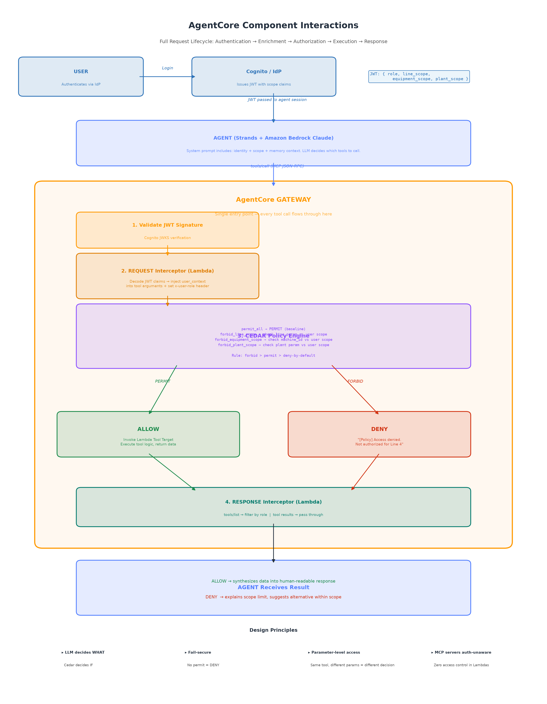

# Architecture Overview

The system follows a layered architecture where each layer is independently scalable and replaceable:

```
User (natural language) → Amazon Bedrock (LLM) → Agent → Semantic Layer → MCP Servers → Data Infrastructure
```

## Layers

### 1. Agent Layer (Amazon Bedrock AgentCore)

A single **Strands Agent** powered by Claude (via Amazon Bedrock) receives the user's natural language query. It has access to tools from all MCP servers and autonomously decides which to call.

### 2. Gateway (Policy Enforcement)

Every tool call passes through the Gateway before reaching an MCP server. The Gateway:
- Evaluates **Cedar-style access policies** against the user's identity
- Applies a **three-tier cache** (org-scoped, user-scoped, policy-aware)
- Routes requests to the correct MCP server by tool name

If a user doesn't have access, the call is **denied at the Gateway** — the MCP server never sees the request.

### 3. Semantic Layer (SageMaker Data Catalog)

Before calling domain tools, the agent consults the Semantic Layer to understand **what data exists where**. This layer provides:
- Table schemas and column descriptions
- Business glossary terms (maps "OEE" → analytics server)
- Data lineage (where data originates, how fresh it is)
- Source mappings (which MCP tools serve which data)

This separation means new data sources can be onboarded by **registering them in the catalog** — no code changes to the agent.

### 4. MCP Servers (Pre-Built Connectors)

Each business domain is represented by a dedicated MCP server exposing typed tools:

| Server | Tools | Production Data Source |
|--------|-------|----------------------|
| Equipment | `get_equipment_status`, `get_maintenance_history` | Aurora PostgreSQL (via SAP S/4HANA Zero-ETL) |
| IoT Telemetry | `get_sensor_readings`, `detect_anomaly` | Amazon Timestream (via IoT Core → MSK) |
| Supply Chain | `check_parts_inventory`, `get_supplier_lead_times` | Redshift Serverless (via SAP MM Zero-ETL) |
| Analytics | `get_oee_trends`, `get_quality_metrics` | OpenSearch Serverless + Redshift |

### 5. Data Infrastructure

The foundation layer unifies data from operational and analytical systems:
- **Amazon Aurora** — operational data (equipment, maintenance)
- **Amazon Timestream** — IoT time-series sensor data
- **Amazon Redshift** — analytics warehouse (OEE, supply chain)
- **Amazon OpenSearch** — semantic search on quality documents
- **Amazon S3** — data lake (raw data, configuration, catalogs)

## Sequence Diagrams

### Access Control Flow

This diagram shows the end-to-end lifecycle of a request through the AgentCore Gateway — from authentication (Cognito JWT) through the REQUEST Interceptor, Cedar Policy Engine evaluation, and finally tool execution or denial:


### User Personas — Same Interface, Different Access

Three users ask similar questions but receive different results based on their Cedar policy scope. The Gateway blocks unauthorized requests before the MCP server (Lambda target) is ever invoked:


### Component Interactions

The full request lifecycle showing how user identity flows through Gateway components:



## Key Design Principles

1. **Configuration, not code** — add a data source by registering an MCP server
2. **Policy at the chokepoint** — one Gateway enforces all access rules
3. **The LLM is the orchestrator** — no custom routing code needed
4. **Dual-mode data** — simulated for development, live for production
